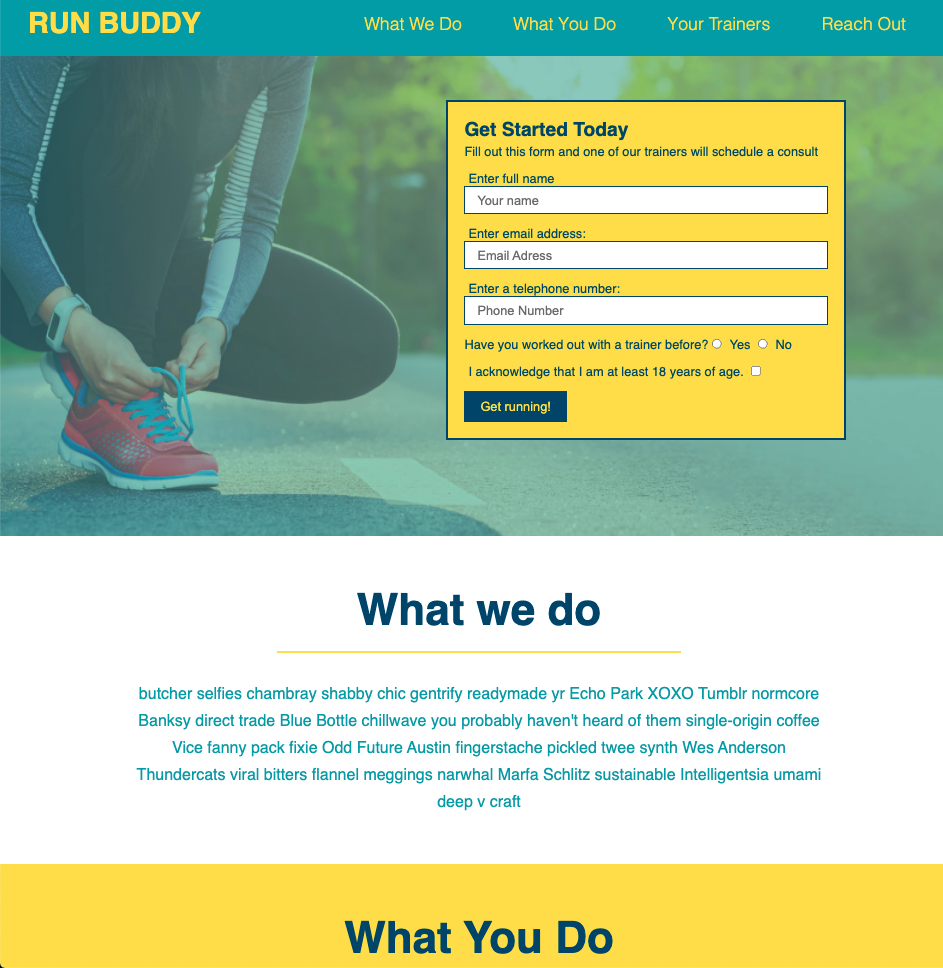

# Run Buddy

A landing page to practice HTML and CSS. This page has a form for users to sign up as a Call To Action. The nave bar connects to the different sections of the page to introduce Run Buddy and it's features.



## Table of Contents

|                                         |                                                               |                                                    |
| :-------------------------------------: | :-----------------------------------------------------------: | :------------------------------------------------: |
|   [Project Introduction](#Run-Buddy)    |            [Table of Contents](#table-of-contents)            | [Development Highlights](#development-hightlights) |
|         [Deployment](#deployed)         | [Description of Page Building](#Description-of-Page-Building) |       [Code Hightlights](#code-hightlights)        |
| [Technologies Used](#Technologies-Used) |                      [Credits](#Credits)                      |                [License](#License)                 |

## Development Hightlights

- Turn mockup into app
- Form call to action
- Navbar with links
- Seperate privacy link page
- Plain HTML and CSS

## Deployed

[Deployment](https://anusontarangkul.github.io/run-buddy/)

This app is deployed using GitHub pages.

## Description of Page Building

- In assets
  - CSS for application
  - Images for application
  - Screenshot for README
- In root

  - Index page
  - Privacy page
  - README

## Code Hightlights

Form text inputs

```HTML
          <label for="name">Enter full name</label>
          <input
            type="text"
            placeholder="Your name"
            name="name"
            id="name"
            class="form-input"
          />
          <label for="email">Enter email address:</label>
          <input
            type="email"
            placeholder="Email Adress"
            name="email"
            id="email"
            class="form-input"
          />
          <label for="phone">Enter a telephone number:</label>
          <input
            type="tel"
            placeholder="Phone Number"
            name="phone"
            id="phone"
            class="form-input"
          />
```

Use absolute position to style the hero form inside hero section.

```CSS
        .hero {
        background-image: url('../images/hero-bg.jpeg');
        height: 600px;
        background-size: cover;
        background-position: center;
        position: relative;
        }

        .hero-form {
        color: #024e76;
        background-color: #fce138;
        padding: 20px;
        width: 500px;
        border: solid 3px #024e76;
        position: absolute;
        bottom: 120px;
        right: 140px;
        }`
```

## Technologies Used

- HTML
- CSS

## Credits

|                           |                                                                                                                                                                                                       |
| ------------------------- | ----------------------------------------------------------------------------------------------------------------------------------------------------------------------------------------------------- |
| **David Anusontarangkul** | [ LinkedIn](https://www.linkedin.com/in/anusontarangkul/) [ GitHub](https://github.com/anusontarangkul) |

## License

[](https://opensource.org/licenses/MIT)
